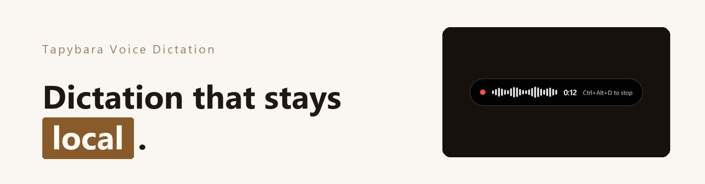
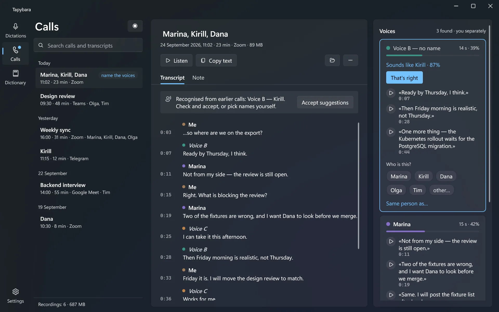

[](https://github.com/keshon/tapybara/actions/workflows/build.yml) [](https://github.com/keshon/tapybara/releases) [](LICENSE)

# Tapybara

Local voice dictation for Windows, written in C#. Press a hotkey, speak, press
it again — the text is inserted where your caret already was, in whatever
application has focus.

<picture>
  <source media="(prefers-color-scheme: light)" srcset="assets/screens/calls-light.webp">
  
</picture>

Windows ships dictation of its own, and the one you reach for with `Win+H` does
the recognition on Microsoft's servers. Tapybara runs
[whisper.cpp](https://github.com/ggerganov/whisper.cpp) on your own GPU instead,
which makes the recording a local file that is deleted rather than a request to
somebody's server.

> **Status: early development.** Dictation works end to end and is used daily.
> Call recording works but is newer and less exercised.

**[tapybara.keshon.ru](https://tapybara.keshon.ru/)** ·
[Download](https://github.com/keshon/tapybara/releases/latest)

## What it's like to use

- Press the hotkey from anywhere and the text lands where you were already
  typing. It is inserted, not left on the clipboard for you to paste, and the
  path it uses works in Electron and Chromium apps too.
- Nothing leaves the machine. No account, no telemetry, and no connection
  needed once a model is downloaded — the installed version asks GitHub for
  the list of releases to update itself, and that can be switched off.
- Pauses become paragraphs. Whisper does not mark them, but its timings say
  where the speaker stopped, so a ten-minute dictation is not one wall of text.
- Escape cancels — and stays available to everything else. Cancelling watches
  the key through a hook rather than claiming it, so dialogs still close and
  menus still dismiss while a dictation runs.
- Models are downloaded from inside the app — one list per kind, with sizes,
  the one in use marked, a click to switch and a menu to delete. Drop one into
  the folder by hand and it appears without a restart.
- A speech detector finds where the speech actually is, so each line gets the
  position it was measured at rather than one the model guessed. It also
  removes the phrases Whisper invents on silence.
- Names it keeps mangling get fixed by a dictionary of replacements — including
  ones carrying punctuation, like `C#` and `.NET` — that grows as you correct
  transcripts, can be applied to calls transcribed before, and moves to a new
  computer as one file.
- Every dictation is kept, so one that went into the wrong window is never
  lost. Switch it off if you dictate passwords.
- It stays out of the way: a tray icon, a floating indicator you can drag
  wherever you want it, one window for what you come back to — dictations,
  calls, dictionary — and a settings window you visit once.
- Calls are recorded as two separate tracks — your microphone and your system
  audio — and merged into one transcript. Transcription starts the moment the
  recording stops, and can be stopped.
- With more than one other person their voices are told apart on your own
  machine, and you name each voice from its quotes and by listening to it. A
  name is a person: a voice the splitter tore off someone joins them when you
  pick the same name, and detaches with a click. You are on the list too, with
  your share of the call. Every line is checked against its voice, and the
  ones that do not fit are marked.
- Named voices are remembered, so on the next call Tapybara suggests who is
  speaking — a suggestion you accept, never a label it applies on its own. The
  voiceprints stay on this computer and are forgotten with one button.
- A misheard word is fixed once for the whole call: double-click it, and every
  way it was misheard is replaced together, in place, without transcribing
  again. The playing line lights up as it sounds and the transcript follows.
- A transcript can be copied without the names — everyone as an alias, the
  mentions in the text included — while the call keeps the real ones. Renaming
  someone for real changes them in every call at once.

## Getting started

Download `Tapybara-win-Setup.exe` from the
[latest release](https://github.com/keshon/tapybara/releases/latest) and run
it. It installs for your user without administrator rights, and keeps itself
up to date: a new version downloads in the background and installs the next
time Tapybara starts. No .NET needed — the build is self-contained.

For a portable copy, unzip `Tapybara-*-win-x64.zip` from the same page instead
and run `Tapybara.exe`; that one is updated by hand.

On first launch a short window walks you through it: download a model
(`Large v3 Turbo (q5_0)` is a reasonable first pick at about 550 MB), check the
microphone, dictate a first sentence. Nothing works until a model is there;
**Settings › Models** has the full list later.

Put the caret in any text field and press `Ctrl`+`Alt`+`D`. Speak. Press it
again. `Ctrl`+`Alt`+`C` starts and stops recording a call.

Or build it yourself:

```bash
git clone https://github.com/keshon/tapybara
cd tapybara
build.cmd run
```

`build.cmd` also takes `build`, `debug`, `test`, `publish`, `installer` and
`stop`; `installer` packs `Setup.exe` and the update packages into `Releases\`
with [Velopack](https://velopack.io), exactly as CI does. It stops
a running instance first — politely, then forcibly if it does not respond —
which matters because the app lives in the tray and is easy to forget about
while it holds the output files locked.

Full setup, model advice, settings and troubleshooting are in
[`docs/running.md`](docs/running.md).

## Performance

Measured on an RTX 3060 and an i5-9600KF, transcribing one 28-second sample
with `large-v3-turbo`:

| Backend | Time | Speed |
|---|---|---|
| CPU | 26.2 s | 1.1× realtime |
| Vulkan, first run | 12.6 s | 2.2× realtime |
| Vulkan, warmed up | **0.52 s** | **53× realtime** |

The first run is slow because Vulkan compiles its compute shaders on first use.
Tapybara hides this by warming the engine up at startup, so the first real
dictation is already fast.

One sample on one machine, not a benchmark suite. Which backend is actually in
use is shown in Settings › About — the library falls back silently from GPU to
CPU, and a fiftyfold difference in speed is otherwise inexplicable.

## How it works

```
hotkey ─► microphone ─► speech detection ─► Whisper ─► post-processing ─► insertion
         WASAPI          Silero VAD          whisper.cpp   filters,        clipboard
         16 kHz mono     measured timings    via Vulkan    replacements    + Ctrl+V
         float32                             beam search
```

Recognition runs with **no cross-window context**. Whisper normally feeds each
30-second window's output into the next; on long dictation with pauses that
sends the model into repetition loops and triggers temperature fallback, which
is dramatically slower. Disabling it is the single most important setting in
the whole pipeline.

Decoding weighs several wordings of a phrase and scores them whole, rather than
committing to the likeliest next word and never reconsidering. On one 28-second
sample it costs about half again in time — 0.46 s against 0.70 s — and fixes
errors that greedy decoding reproduces every run. Settings › Advanced can
trade it back for speed.

Calls are two tracks rather than one, and for a conversation between two people
that alone settles who said what: whoever spoke is decided by which track the
speech landed on. Keeping the tracks aligned is harder than it sounds, because
WASAPI loopback delivers nothing at all while the far side is silent.

With more than one person on the far side, that track is split by voice —
pyannote segmentation and a speaker-embedding model, both ONNX, both on the
CPU, both offline. Your own track is never analysed; it belongs to the
microphone owner by construction, which also keeps the loudest and most
interrupting voice out of the hardest part of the problem. Knowing how many
voices to look for matters more than any threshold, which is why the app asks.

[`docs/architecture.md`](docs/architecture.md) covers the pipeline, the call
recorder and the Windows-specific traps in full.

## Development

```
src/Tapybara.Core/         engine, audio, settings, Win32 plumbing — no UI
src/Tapybara.App/          WPF application: tray, overlay, main window, settings
tests/Tapybara.Core.Tests/ unit tests for the pure logic in Core
tools/Tapybara.Bench/      console harness for benchmarking and diagnostics
tools/site/                demo data and the script that takes the site's screenshots
```

All logic lives in `Core`, which has no dependency on the user interface. That
is what lets the whole pipeline be exercised from the console, and it is how
the benchmarks above were produced. `Core` also owns no user-facing strings: it
reports typed values, and `App` decides the wording.

```bash
build.cmd test
```

- [`docs/conventions.md`](docs/conventions.md) — house rules. Read before a
  first change.
- [`docs/architecture.md`](docs/architecture.md) — how the pieces fit, and the
  Windows traps that shaped them.
- [`docs/running.md`](docs/running.md) — the user-facing manual.
- [`docs/brand.md`](docs/brand.md) — the mark, the palette, the site assets.
- [`docs/csharp-notes.ru.md`](docs/csharp-notes.ru.md) — notes in Russian on
  the C# used here. Code comments are in Russian by design.

## Releases

Every push to `main` builds and tests on Windows and leaves a ready-to-run
zip and `Setup.exe` as workflow artifacts. Pushing an annotated tag publishes
a GitHub Release, with the tag's message body as the notes. The release
carries the zip, the installer and the Velopack update packages — including a
delta from the previous release, a fraction of a megabyte instead of a hundred
— and installed copies pick it up from there:

```bash
git tag -a --cleanup=verbatim v0.4.0 -F notes.md
git push origin v0.4.0
```

`--cleanup=verbatim` is not optional — see the release section of
[`docs/conventions.md`](docs/conventions.md) for why.

## Roadmap

- Shipping preset dictionaries is deliberately **not** planned: a replacement
  fires without understanding context, and a wrong entry in a preset silently
  corrupts text for someone who never opened the list. Your own dictionary
  moves between computers with Dictionary › Export and Import.
- Code signing, so Windows stops warning about an unknown publisher on first
  run
- Push-to-talk in addition to toggle
- Streaming recognition, so the tail latency approaches zero
- Per-application system audio capture, so a call recording contains the call
  and not the notifications
- Automatic call detection, so recording starts when a call does
- Summaries of recorded calls

## License

[MIT](LICENSE) © Innokentiy Sokolov (Señor Mega / Big M)
